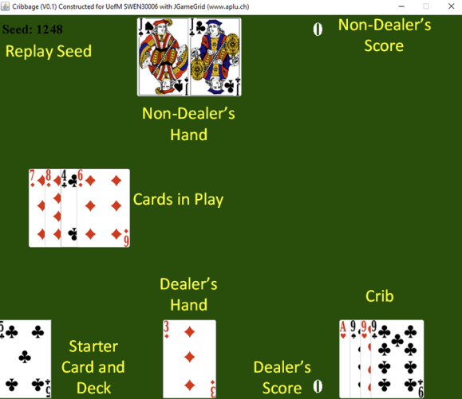

# SWEN30006-Projects
Software Modelling &amp; Design Projects, centred on design patterns. 

# Project 1: 87.5%
This project involved the modification and extension of a Robotic Mail Delivery system called Automail.

#  Project 2: 85%
This project was the modification and extension of a cribbage game, adding an extemsible scoring and logging system to the game.

## Setup in eclipse

File > open projects from filesystem > directory > select directory > finish

right click project in eclipse > 
build path > configure build path > libraries > add JAR > 
Cribbage > dist > JGameGrid.jar > apply

